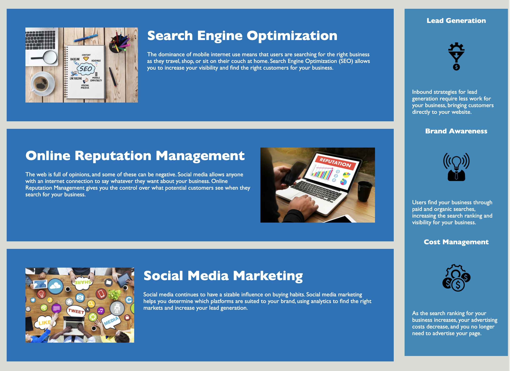

# Horiseon Functionality Refactor 

## Description

This project includes a refactoring of Horiseon to improve the functionality and accessibility of the website. In this project, I improve the existing code and fix minor semantic issues. I simplify code within the CSS and ensured that the project operated successfully. 

## Visuals

## Link

Link to Repository : https://github.com/giovannaruggio/horiseon-functionality-refactor

Link to Deployed Application : https://giovannaruggio.github.io/horiseon-functionality-refactor/